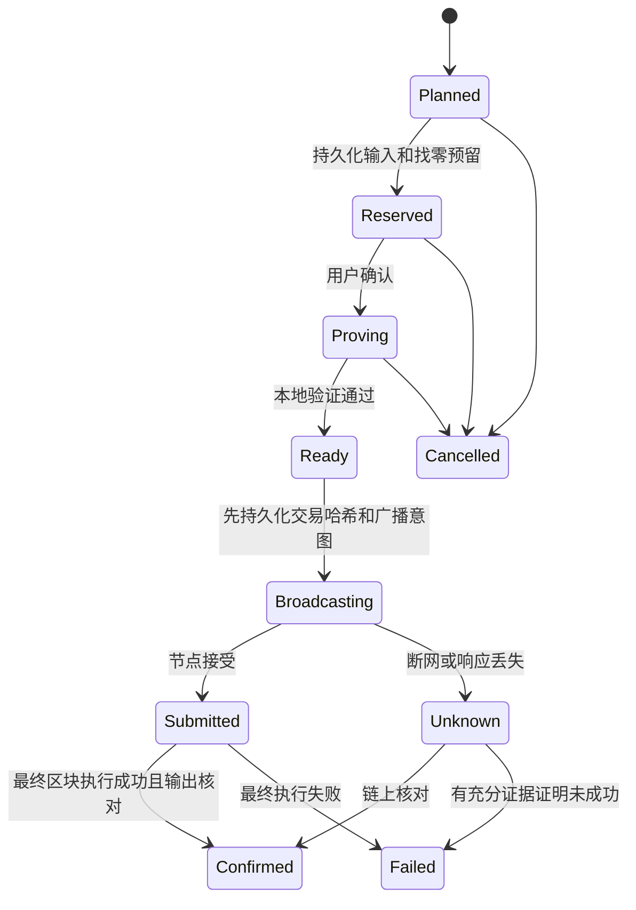

# Quantus Vault 隐私钱包设计 v0.1

日期：2026-09-11。状态：可评审设计，尚未实现完整隐私钱包，不改变当前发布包。

目标：同一助记词恢复普通与隐私资产；在本地生成证明；明确资产状态、费用和隐私边界。普通钱包默认主网保持不变，隐私写入功能先限定 Planck 测试网，单独通过发布门槛后才开放主网。

## 1. 已核对的协议与证据

本次从官方 quantus-apps 远端获取 HEAD `e843b06b49e4c208f7b4a8c603a91f4578780e96`，核对相关文件。开源仓库只保留来源链接和快照摘要，不再分发这些参考源码。这不代表主网当前已部署完全相同的协议。

| 项目 | 官方代码中的事实 | 本钱包设计决策 |
|---|---|---|
| 派生路径 | `m/44'/189189189'/0'/0'/n'` 为收款，`m/44'/189189189'/0'/1'/n'` 为找零；全部 hardened | 第一版仅隐私 account=0，绝不把普通账户序号自动代入隐私路径 |
| 种子 | Rust 以 `derive_wormhole_from_mnemonic(mnemonic, None, path)` 派生 | 使用官方库固定版本；第一版不接受 BIP39 附加口令；本地解锁密码不参与链上账户派生 |
| 派生结果 | address、first_hash、secret | secret 只在密码学 Worker 内使用；不把 first_hash 当作 secret，首版不开放矿机配置导出 |
| 花费标识 | `compute_nullifier(secret, transfer_count)` | 按官方库计算，不自行重写哈希、域分离或编码 |
| 资产发现 | 索引器入账含 amount、leaf_index、transfer_count；官方同时扫描收款/找零 | 索引器用于发现候选，不能将查询结果直接认定为可花费余额 |
| 地址发现 | 默认连续 20 个未使用地址停止 | 20 是发现策略，不是全量恢复保证；必须提供扩展扫描范围 |
| 证明 | SDK 电路版本 4.3.0，批次最多 7 输入，每输入支持两个输出 | 固定兼容组合并核对链上参数，短批按官方规则填充 |
| 金额 | SDK scale factor 为 10^10 基础单位；12 位币种精度对应 0.01 币 | 所有计算用整数，不能默默四舍五入；链上参数变更停止发送 |
| 发送 | SDK 构造 unsigned extrinsic，调用 verifyPrivateBatch；RPC `author_submitExtrinsic` | 不套用普通 Dilithium 转账签名流程；按固定 metadata 编码 |
| 路径查询 | `zkTree_getMerkleProof(leafIndex, blockHash)` | 对同一可信 finalized checkpoint 的根、头、叶子进行一致性核验 |

证据链接：
- [派生路径](https://github.com/Quantus-Network/quantus-apps/blob/e843b06b49e4c208f7b4a8c603a91f4578780e96/quantus_sdk/lib/src/services/hd_wallet_service.dart)
- [地址发现](https://github.com/Quantus-Network/quantus-apps/blob/e843b06b49e4c208f7b4a8c603a91f4578780e96/quantus_sdk/lib/src/services/account_discovery_service.dart)
- [账户与找零管理](https://github.com/Quantus-Network/quantus-apps/blob/e843b06b49e4c208f7b4a8c603a91f4578780e96/quantus_sdk/lib/src/services/encrypted_account_service.dart)
- [入账和 nullifier 扫描](https://github.com/Quantus-Network/quantus-apps/blob/e843b06b49e4c208f7b4a8c603a91f4578780e96/quantus_sdk/lib/src/services/wormhole_utxo_service.dart)
- [证明与广播](https://github.com/Quantus-Network/quantus-apps/blob/e843b06b49e4c208f7b4a8c603a91f4578780e96/quantus_sdk/lib/src/services/wormhole_send_service.dart)
- [密码学接口](https://github.com/Quantus-Network/quantus-apps/blob/e843b06b49e4c208f7b4a8c603a91f4578780e96/quantus_sdk/rust/src/api/crypto.rs)
- [电路参数和证明接口](https://github.com/Quantus-Network/quantus-apps/blob/e843b06b49e4c208f7b4a8c603a91f4578780e96/quantus_sdk/rust/src/api/wormhole.rs)
- [QIP-2](https://github.com/Quantus-Network/improvement-proposals/blob/main/qip-0002.md) 为 Draft；[QIP-5](https://github.com/Quantus-Network/improvement-proposals/blob/main/qip-0005.md) 为协议背景。部署兼容性必须以实际链验证为准。

## 2. 隐私账户与恢复

### 用户流程

钱包首页新增“普通 / 隐私”切换。首次进入隐私页，说明同一助记词、单独隐私余额、需要扫描；点击“开始同步”。未完成可恢复收付款闭环前，不提供可收款二维码。

导入助记词后先展示普通账户，隐私资产同步独立显示，不阻塞普通钱包。两条隐私分支均从索引 0 开始。已有本地最高使用索引时至少覆盖该索引，再扫描后续空地址。恢复进度分别显示“发现地址”“同步入账”“核对已花费资产”，展示地址范围与同步高度，不伪造百分比。

只有索引器已覆盖目标 finalized 高度、所有分页查询完成且 nullifier 状态核对成功，才能标记“已同步至区块 H”。RPC 超时、分页中断、索引器落后都显示“尚未完成”，不能当作余额为零。

### 恢复边界

- 助记词能重建 secret 和地址，找回资产还需要完整链上历史和正确发现范围。
- 连续 20 个空地址之外可能仍有资产，尤其是外部工具使用高索引或多次取消生成找零地址。提供“扩大扫描范围”，输入收款/找零最大索引，可暂停续扫。
- 新收款地址不因每次打开页面而递增；仅显式请求新地址时分配。分配前持久化索引；不主动制造超出默认发现窗口的大量空地址。
- 找零索引在构建计划时持久化预留。未广播的取消交易可在严格互斥下重用尚未公开的预留；已广播或结果未知的地址绝不重用。发现缺口风险时停止继续跳号并提示。
- 可选加密恢复辅助文件保存网络、路径版本、最高预留/使用索引、扫描起点；不能把它描述为助记词的替代品，也不能用扫描起点跳过可能存在的早期资产。
- 助记词单独恢复无法还原未上链交易的本地意图。先核对 mempool（若有可靠接口）、链上花费与输出；不承诺恢复后立即可安全重发。证明有效期及冲突处理需官方确认。
- 地址簿、备注、设备日志、未广播计划不保证仅靠助记词恢复。

## 3. 隐私余额与收款

余额划分为：已确认可用、待确认入账、发送占用、结果待核对、精度余量。首页主余额只统计已核实、未花费、未预留且满足证明条件的资产；未完成同步时标记“已发现”，不展示成完整总额。

扫描管线：

每条候选记录至少包含网络创世哈希、地址分支/索引、入账 ID、区块哈希/高度、transferCount、leafIndex、原始金额和资产 ID。去重不能只靠区块高度；排序使用稳定唯一键。冻结同步上界，分页异常不推进游标。节点索引格式尚未确认时，不能凭猜测构造请求。

索引器可遗漏历史，Merkle 成员证明只能证明“这条存在”，不能证明“没有别的”。第一版使用明确列出的可信官方服务，显示索引延迟；完整性保证仍依赖服务，未来再评估归档节点全扫描或独立索引器交叉核对。RPC 提供的区块头也不是轻客户端验证：第一版信任固定官方 RPC 的链视图，界面不得宣称无需信任。

收款页面显示网络、资产、完整地址、二维码和复制入口。地址复用会暴露多笔入账属于同一地址；提供新地址操作但遵守发现范围约束。金额和入账地址仍可能公开。“隐藏余额”仅遮挡屏幕，不改变链上隐私。

## 4. 转账、找零与长时间证明

用户步骤：填写收款地址和金额 → 检查余额及费用 → 查看公开信息 → 输入密码确认 → 本地生成证明 → 发送 → 等待最终确认。

确认页固定显示：网络、收款完整地址、收款金额、协议费用、输入数量/批次数、找零、精度余量处理、预计耗时。说明输出地址/金额、nullifier 和交易时序可能公开；RPC/索引器可看到 IP 与查询，地址的哈希查询也不等于匿名。

第一版仅接受已明确网络的 Quantus 原生资产地址。不凭 SS58 格式判断收款人是否拥有某个 Wormhole secret；“隐私输入 → 普通地址”会产生普通公开余额，给收款人的提示应与实际输出类型一致。隐私地址识别或 URI 标准待官方确认。

选币复用现有 `src/core/privacy/selection.ts`，接入前逐项核对批次费率、基础费、精度与上限。按每批检查守恒：输入 = 收款 + 找零 + 实际费用 + 明确披露的不可回收余量。不能让用户仅领取一部分后误以为还能用同一入账再次领取剩余金额；剩余可用值应在同一证明中作为找零处理。无法准确解释或处理余量则拒绝该计划。

证明页使用专用扩展标签页和专用 Worker，不使用 popup 的 30 秒 Worker 限制。当前公开构造数据实验约 65 秒，不作为真实交易性能承诺。第一版只允许一个证明任务；阶段进度来自实际步骤或完成输入数，不用虚假百分比。记录设备测试的耗时分布和内存峰值，确定超时及支持设备范围。

首版采用“保持页面可见；切换离开或锁定即取消未提交证明”的明确行为，专用页醒目提示。后台继续计算与延长自动锁定不在首版范围，不能暗中改变普通钱包的两分钟锁定策略。超过会话有效期则终止 Worker，重新确认；若实测正常任务无法在限制内完成，必须先另行设计显式授权的有限证明会话，不能直接取消锁定。

密码验证后只在受限 Worker 中派生花费材料。secret、完整 witness 不进入页面、持久存储、错误日志或远程服务。公共证明产物也不默认上传第三方聚合器。电路/WASM/验证器固定版本与校验和，本地校验证明与已确认计划一致，然后在广播前重查链版本、checkpoint 可用性、nullifier、费用、会话状态和预留记录。

## 5. 广播与恢复状态机

节点接受只表示进入交易池，不表示已经到账。多批发送不是原子操作：已成功批次不能回滚。逐批保存哈希、输入、预期输出、结果；界面区分“部分完成 / 剩余未发送 / 结果待核对”，禁止整个计划盲目重发。

每个网络使用同一跨页面互斥锁保护输入预留、广播及确认写入。存储失败时禁止发送。RPC 超时不自动重播，也不释放未知输入；只读重查交易、nullifier 和输出。不能仅因为索引器查不到交易或超过本地时间阈值就认定失败。重组后的未最终确认记录重新核对，已最终确认状态冲突视为节点异常并停止写入。

## 6. 数据与模块边界

建议新增：`privacy/derivation`、`discovery`、`scanner`、`proof-inputs`、`prover-client`、`journal`、`submit`、`reconcile`；UI 新增 privacy-home、privacy-receive、privacy-review、privacy-progress、privacy-recovery。都是规划路径，当前未创建实现。

隐私缓存与交易日记使用独立加密存储，不能直接沿用当前普通交易明文 history。为每个记录生成独立随机 IV，AAD 绑定 schema、网络、钱包标识、记录类型和 ID。记录版本及修订号用于并发检查；加密不防本地数据回滚，重开后仍需链上核对。

记录模型：
- `PrivacyAccountState`：pathVersion、networkGenesis、account=0、外部/找零分支最高使用及预留索引。
- `ScanCheckpoint`：finalizedHash/height、索引器覆盖高度、发现范围、已完成分页游标、完整性状态。
- `Credit`：稳定入账 ID、链上定位、地址分支/索引、金额、nullifier、验证状态；不含 secret。
- `SpendIntent`：planHash、批次、预留输入、找零索引、checkpoint、参数/电路指纹、确认时间、每批交易哈希与状态。

只在解锁时解密这些记录；锁定清空内存映射，terminate Worker，取消请求。索引器域名白名单会增加扩展权限，必须按已验证端点精确配置，不能添加 `<all_urls>`。不得携带登录 cookie、遥测或助记词。密钥、查询和证明错误不写含输入的日志。

## 7. 测试与发布门槛

| 阶段 | 必须验证 | 通过条件 |
|---|---|---|
| 派生向量 | 官方 12/24 词、两分支、索引 0/1/20/高索引；secret/address/nullifier 对照 | 与固定官方 Rust/SDK 完全一致；只使用公开测试种子 |
| 助记词恢复 | 全删本地缓存后恢复收款、找零、多次支出；空缺超过 20；索引器落后 | 已知资产均可发现；缺口明确提示，可扩展扫描；不出现虚假零余额 |
| 扫描健壮性 | 同区块多入账、重复页、丢页、重组、伪造金额/路径、跨网络记录 | 不重计、不漏页、不接受未经核验的可用余额；错误不推进检查点 |
| 余额/选币 | 零、边界、7/8/14 输入、费用变化、找零/dust、溢出 | 每批守恒、无精度损失、无重复输入 |
| 证明 | 合法证明与各 witness 字段篡改、错误电路、错误根、错误输出、内存与取消 | 本地验证和测试网验证一致；篡改失败；超时终止且无秘密持久化 |
| 转账闭环 | 普通入隐私、隐私出普通、隐私至可恢复隐私地址、找零恢复 | finalized 执行成功且到账与计划一致；各方向受部署协议支持 |
| 故障恢复 | 写盘失败、Worker 崩溃、关页、锁定、两窗口竞争、广播响应丢失 | 未持久化不发送；未知状态不重发；迟到消息不能解锁或覆盖新状态 |
| 多批 | 第一批成功后第二批失败/取消/未知 | 逐批准确显示，仅处理未完成部分，不重复支付 |
| 安全审查 | secret/witness 外泄、XSS/CSP、依赖与构建来源、权限、存储回滚 | 修复严重问题，独立审计完成后再开放主网写入 |

设计阶段没有执行隐私链上转账，也没有获得“主网可上线”的结论。先用隔离的 Planck 测试账户和测试资产完成闭环，不使用现有主网账户试验。

## 8. 待官方确认清单与实施顺序

优先确认：
1. 主网/Planck 当前 runtime、metadata、验证器与 4.3.0 电路的精确兼容矩阵，官方构建哈希及升级策略。
2. BIP39/HD 库推荐版本、双分支公开测试向量、account>0 约定及高索引恢复建议；是否存在需要单独处理的矿工 first_hash 导入。
3. 索引器两网端点、完整性/分页/重组/历史保留语义，链上 nullifier 查询接口及归档 Merkle proof 可用范围。
4. checkpoint 最大年龄、finalized checkpoint 是否可用、unsigned 交易有效期与重放/冲突处理。
5. 基础费与比例费公式、量化/找零余量规则、最大输入值、批次大小及资产范围。
6. 输出公开字段、隐私地址标识规范、推荐收款方式和官方安全审计范围。

实施顺序：A. 固定依赖和测试向量 → B. 双分支派生与只读恢复 → C. 加密缓存和预留日记 → D. 独立证明页及本地验证 → E. Planck 单批闭环 → F. 多批/故障恢复 → G. 独立审计和主网评审。

A/B 可先实施，未确认接口不写死为生产假设。首个可验收交付是“公开测试助记词恢复官方一致的两分支地址，并完整显示测试网资产发现状态”。本设计不发送合作邮件、不发布源码、不部署链上功能；这些动作不属于本次设计交付。
